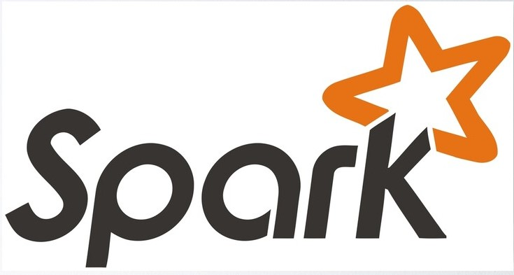
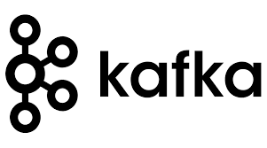

<h1 align="center">Hi, I'm Mina Adel Markos 👋</h1>

<h3 align="center">I am a dedicated Big Data Engineer and Business Intelligence Developer with a proven track record of delivering successful data-driven solutions. My diverse skill set spans SQL, Python, Data Analytics, Business Intelligence, Microsoft SQL Server, Power Automate, SQL Server Reporting Service, database development, administration, and performance tuning. I specialize in Data Warehousing (DWH), Extract Transform Load (ETL), Data Science, and Data Visualization (Power BI, Matplotlib, Seaborn, Dash, and Plotly).

Proficient in managing a range of database technologies, including MYSQL, SQLite, and Microsoft Office (Excel, PowerPoint, Access), I offer a wealth of knowledge and experience in Data Engineering. My big data expertise encompasses Apache Hadoop, Spark, Kafka, Oozie, and NiFi. Additionally, I am skilled in NoSQL databases like HBase and the Hadoop ecosystem, as well as data processing with Yarn.

My capabilities extend to modern data technologies such as Docker and cloud platforms like Microsoft Azure, where I deploy scalable, high-performance solutions. My recent work includes experience with Microsoft Fabric, a comprehensive end-to-end data analytics solution.

I am also proficient in Hive, Impala, Cloudera CDP Cluster, HDFS, Hue, and various data orchestration tools, enhancing my ability to design and manage complex data pipelines. In addition, my expertise in web scraping techniques using Selenium and BeautifulSoup allows me to gather and analyze data from a variety of online sources.

With a keen eye for detail and a commitment to delivering high-quality, innovative solutions, I am well-prepared to contribute to projects requiring a blend of technical prowess and strategic thinking. My repositories showcase contributions to big data, data science, and business intelligence. I am open to collaboration and eager to bring my skills to projects that demand creativity, innovation, and excellence.

Let's connect and explore how I can help you achieve data-driven insights and transformative business outcomes.</h3>

 

 

## EDUCATION 

-  Bachelor's Degree of Engineering (2021) -- Alexandria University, Egypt
-  Certified Data Scientist Professional Training Progra 9 Months Programg -- EPSILON AI Institute
-  IBM Data Science Professional Certificate 2022 -- Coursera
-  Cloudera Data Analyst Professional Certificate 2025, Cloudera
-  Cloudera Data Engineer Professional Certificate 2025, Cloudera
-  Google Business Intelligence Certificate – Google (3 Months)

## EXPERIENCE 

<h3>BI & Big Data Quality Sr. Specialist@ VODAFONE</h3>

- Administered **3 large-scale clusters** (60+ machines), ensuring **high availability**, **performance**, and **reliability**.
- Utilized **Linux shell scripting** for:
  - Node management  
  - System health monitoring  
  - Resource utilization optimization  
- Automated critical tasks:
  - Log management  
  - HBase compaction  
  - YARN queue performance tracking  
  > 🕒 Result: Reduced processing time by **70%**.

## Monitoring & Ecosystem Tools
- Implemented **proactive monitoring and alerting** systems for:
  - Kafka  
  - Oozie  
  - HDFS storage  
- Ensured **seamless operations** and prevented disruptions.
- Leveraged Hadoop ecosystem tools:
  - Kafka, NiFi, HBase, Impala, Oozie, YARN, HDFS  

## Project Highlights
### Telecom Finance RAID Project
- Enhanced **data pipelines and workflows** to support **real-time analytics** and **risk mitigation**.

## Advanced Analytics & Visualization 📉
- Developed **Power BI dashboards** for actionable insights:
  - **AOM Dashboard**📉:  
    - 🧠 Tracked customer behavior and KPIs  
    - 💸 Reduced revenue loss by **80%**
  - **Execution Time Dashboard**💻:  
    - 🕵️ Monitored machine performance and system efficiency
  - **Data Quality Dashboard** 📊:  
    - 🔗Integrated data from **Cloudera** and **Oracle**  
    - ✅Highlighted data quality metrics

<h3>Big Data Engineer & Business Intelligence System Analyst @ VODAFONE</h3>

-  Administer and manage databases related to telecom operations, including performance tuning, troubleshooting, and ensuring data security.
-  Design, develop, and maintain scalable and efficient data pipelines for the collection, processing, and storage of large volumes of telecom data.
-  Create and maintain data models to support business requirements, ensuring data integrity and optimal performance.
-  Provide support for data-related issues, troubleshoot problems, and implement solutions to ensure minimal disruption to ongoing operations.

<h3>Business Intelligence Analyst | Power BI Developer @MCS Analytics</h3>

-  Clean, prepare, organize and facilitate access to different types of datasets.
-  Extract data from multiple sources.
-  Use of Machine Learning techniques: Regression, Classificationand Clustering, with ability to build Machine Learning Pipelines

<h3>Data Analyst | Junior Data Scientist @ UPWORK</h3>

-  Write codes to collect, crunch and analyze data from internal and external sources
-  Build machine and tune learning models using Python
-  Learn how can extract useful insights to improve the productivity

## 📩 Contact With Me

 

 

<!-- 
 
		   
  -->
 

## skills 👀

<h3 align="left">Languages and Tools:</h3>

                     

