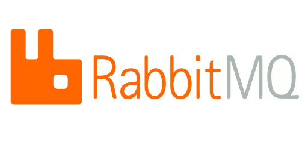
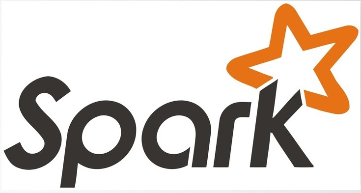
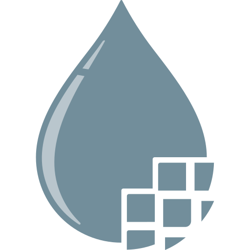
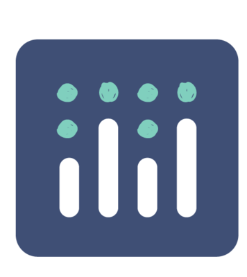
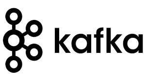

<h1 align="center">Hi, I'm Mina Adel Markos 👋</h1>

<h3 align="center">
𝐁𝐢𝐠 𝐃𝐚𝐭𝐚 𝐄𝐧𝐠𝐢𝐧𝐞𝐞𝐫 and 𝐁𝐮𝐬𝐢𝐧𝐞𝐬𝐬 𝐈𝐧𝐭𝐞𝐥𝐥𝐢𝐠𝐞𝐧𝐜𝐞 𝐃𝐞𝐯𝐞𝐥𝐨𝐩𝐞𝐫 with over 𝐟𝐢𝐯𝐞 𝐲𝐞𝐚𝐫𝐬 of experience 𝐝𝐞𝐬𝐢𝐠𝐧𝐢𝐧𝐠, 𝐚𝐮𝐭𝐨𝐦𝐚𝐭𝐢𝐧𝐠, 𝐚𝐧𝐝 𝐨𝐩𝐭𝐢𝐦𝐢𝐳𝐢𝐧𝐠 end-to-end data platforms that turn raw data into actionable insights.
</h3>

## About Me

I specialize in 𝐂𝐥𝐨𝐮𝐝𝐞𝐫𝐚 𝐂𝐃𝐏, 𝐃𝐚𝐭𝐚𝐛𝐫𝐢𝐜𝐤𝐬, 𝐀𝐩𝐚𝐜𝐡𝐞 𝐒𝐩𝐚𝐫𝐤, 𝐊𝐚𝐟𝐤𝐚, 𝐍𝐢𝐅𝐢, 𝐀𝐢𝐫𝐟𝐥𝐨𝐰, 𝐇𝐢𝐯𝐞, 𝐇𝐁𝐚𝐬𝐞, 𝐈𝐦𝐩𝐚𝐥𝐚, 𝐑𝐚𝐧𝐠𝐞𝐫, 𝐀𝐭𝐥𝐚𝐬, 𝐏𝐲𝐭𝐡𝐨𝐧, 𝐒𝐐𝐋, 𝐚𝐧𝐝 𝐏𝐨𝐰𝐞𝐫 𝐁𝐈. My expertise covers building real-time and batch pipelines, developing data Lakehouse and data mesh architectures, and orchestrating multi-cloud workflows across 𝐀𝐳𝐮𝐫𝐞, 𝐀𝐖𝐒, 𝐚𝐧𝐝 𝐆𝐂𝐏.

I’ve delivered scalable data solutions that cut processing time by 70%, improved data quality and governance, and automated monitoring and alerting pipelines. My work bridges data engineering and analytics — driving measurable value through optimized data flow, visibility, and performance.

## 𝑲𝒆𝒚 𝑹𝒆𝒔𝒑𝒐𝒏𝒔𝒊𝒃𝒊𝒍𝒊𝒕𝒊𝒆𝒔 & 𝑨𝒄𝒉𝒊𝒆𝒗𝒆𝒎𝒆𝒏𝒕𝒔

- Designed Lakehouse architectures using Databricks Delta Lake, Spark Structured Streaming, and Auto Loader.
- Built CI/CD pipelines for ETL workflows using Jenkins, GitHub Actions, and Terraform.
- Automated metadata-driven ETL frameworks using Airflow, NiFi, and dbt.
- Implemented data lineage, validation, and observability using Atlas and Great Expectations.
- Developed real-time analytics pipelines and feature stores for ML using PySpark MLlib and MLflow.
- Created Power BI dashboards for data quality, performance monitoring, and business KPIs.

## Passion & Focus

I’m passionate about data automation, real-time analytics, and cloud modernization, with a focus on scalability, reliability, and performance. I excel at translating complex business needs into efficient, data-driven solutions.

## Opportunities

🌍 𝐎𝐩𝐞𝐧 𝐭𝐨 𝐫𝐞𝐦𝐨𝐭𝐞 𝐨𝐫 𝐫𝐞𝐥𝐨𝐜𝐚𝐭𝐢𝐨𝐧 𝐨𝐩𝐩𝐨𝐫𝐭𝐮𝐧𝐢𝐭𝐢𝐞𝐬 𝐢𝐧 𝐄𝐮𝐫𝐨𝐩𝐞, leveraging my expertise in Databricks, Cloudera, and modern data engineering to build intelligent, future-ready data platforms.

## 𝐂𝐨𝐫𝐞 𝐒𝐤𝐢𝐥𝐥𝐬

𝘋𝘢𝘵𝘢𝘣𝘳𝘪𝘤𝘬𝘴 | 𝘈𝘱𝘢𝘤𝘩𝘦 𝘚𝘱𝘢𝘳𝘬 | 𝘋𝘦𝘭𝘵𝘢 𝘓𝘢𝘬𝘦 | 𝘒𝘢𝘧𝘬𝘢 | 𝘕𝘪𝘍𝘪 | 𝘈𝘪𝘳𝘧𝘭𝘰𝘸 | 𝘊𝘭𝘰𝘶𝘥𝘦𝘳𝘢 𝘊𝘋𝘗 | 𝘏𝘪𝘷𝘦 | 𝘏𝘉𝘢𝘴𝘦 | 𝘐𝘮𝘱𝘢𝘭𝘢 | 𝘙𝘢𝘯𝘨𝘦𝘳 | 𝘥𝘣𝘵 | 𝘛𝘦𝘳𝘳𝘢𝘧𝘰𝘳𝘮 | 𝘑𝘦𝘯𝘬𝘪𝘯𝘴 | 𝘔𝘓𝘧𝘭𝘰𝘸 | 𝘗𝘺𝘵𝘩𝘰𝘯 | 𝘚𝘘𝘓 | 𝘗𝘰𝘸𝘦𝘳 𝘉𝘐 | 𝘈𝘻𝘶𝘳𝘦 | 𝘈𝘞𝘚 | 𝘎𝘊𝘗 | 𝘋𝘢𝘵𝘢 𝘓𝘢𝘬𝘦𝘩𝘰𝘶𝘴𝘦 | 𝘙𝘦𝘢𝘭-𝘛𝘪𝘮𝘦 𝘚𝘵𝘳𝘦𝘢𝘮𝘪𝘯𝘨 | 𝘋𝘢𝘵𝘢 𝘎𝘰𝘷𝘦𝘳𝘯𝘢𝘯𝘤𝘦 | 𝘊𝘐/𝘊𝘋

 

 

## EDUCATION 

-  Bachelor's Degree of Engineering (2021) -- Alexandria University, Egypt
-  Certified Data Scientist Professional Training Progra 9 Months Programg -- EPSILON AI Institute

## Certifications & Professional Credentials

<table>
  <tr>
    <td>
      
    </td>
    <td>
      <a href="https://www.databricks.com/learn/certification/data-engineer-associate" target="_blank"><b>Databricks Data Engineer Associate</b></a>
    </td>
  </tr>

  <tr>
    <td>
      
    </td>
    <td>
      <a href="https://www.credly.com/badges/24aeb28b-230e-431d-97f6-0a119467be97" target="_blank"><b>Cloudera Certified Data Engineer</b></a>
    </td>
  </tr>

  <tr>
    <td>
      
    </td>
    <td>
      <a href="https://www.linkedin.com/feed/update/urn:li:activity:7304234256363364352/?skipRedirect=true" target="_blank"><b>Cloudera Data Analyst</b></a>
    </td>
  </tr>

  <tr>
    <td>
      
    </td>
    <td>
      <a href="https://www.credly.com/badges/8b69cb52-54d3-4061-9b62-95ffec5dfe96/public_url" target="_blank"><b>Quantexa Data Engineer Certificate</b></a>
    </td>
  </tr>

  <tr>
    <td>
      
    </td>
    <td>
      <a href="https://www.credly.com/badges/17246ff0-7104-4984-847c-becf790523f8" target="_blank"><b>Google Business Intelligence Certificate</b></a>
    </td>
  </tr>

  <tr>
    <td>
      
    </td>
    <td>
      <a href="https://www.credly.com/badges/676d2c1b-e66b-4d6a-b8fa-29e39e6688af/linked_in?t=rlt5az" target="_blank"><b>IBM Data Science Professional Certificate</b></a>
    </td>
  </tr>

  <tr>
    <td>
      
    </td>
    <td>
      <a href="https://www.credly.com/badges/bfcdbe98-8a09-4dc2-a463-60d42d9abc2a" target="_blank"><b>SI Architect Certification</b></a>
    </td>
  </tr>

  <tr>
    <td>
      
    </td>
    <td>
      <a href="https://www.credly.com/badges/90fe88f5-6ab9-4c1f-b338-30a8f2ed6cc6/linked_in?t=sshnzz" target="_blank"><b>Data Analytics Professional - Issued by Vodafone</b></a>
    </td>
  </tr>
</table>

## EXPERIENCE 

<h3>Senior Big Data Engineer @ DataScience Middle East</h3>

- Lead sizing and architecture design for **new Big Data projects** across multiple business domains.
- Installed, configured, and optimized **Cloudera CDP clusters and components**, including:
  - HDFS  
  - YARN  
  - Hive  
  - HBase  
  - Impala  
  - Kafka  
  - NiFi  
  - Spark  
  - Ranger  
  - Atlas  
- Mastered and applied **AML (Anti-Money Laundering)** concepts and technologies to build robust investigation frameworks.
- Designed and implemented **Quantexa-based investigation solutions** for:
  - Entity resolution  
  - Network analytics  
- Developed and deployed **real-time data pipelines** using **Apache Spark** and **Kafka** for high-volume data streams.
- Acted as a **Data Lake architect**, defining business models and ensuring:
  - Data quality  
  - Governance  
  - Impact alignment  
- Integrated and optimized workflows across **Databricks** and multiple cloud platforms:
  - AWS  
  - Azure  
  - GCP  
- Collaborated with cross-functional teams to translate business needs into **scalable data solutions**.
- Drove **data innovation initiatives** to enhance analytics capabilities and business decision-making.

<h3>BI & Big Data Quality Sr. Specialist@ VODAFONE</h3>

- Administered **3 large-scale clusters** (60+ machines), ensuring **high availability**, **performance**, and **reliability**.
- Utilized **Linux shell scripting** for:
  - Node management  
  - System health monitoring  
  - Resource utilization optimization  
- Automated critical tasks:
  - Log management  
  - HBase compaction  
  - YARN queue performance tracking  
  > 🕒 Result: Reduced processing time by **70%**.

## Monitoring & Ecosystem Tools
- Implemented **proactive monitoring and alerting** systems for:
  - Kafka  
  - Oozie  
  - HDFS storage  
- Ensured **seamless operations** and prevented disruptions.
- Leveraged Hadoop ecosystem tools:
  - Kafka, NiFi, HBase, Impala, Oozie, YARN, HDFS  

## Project Highlights
### Telecom Finance RAID Project
- Enhanced **data pipelines and workflows** to support **real-time analytics** and **risk mitigation**.

## Advanced Analytics & Visualization 📉
- Developed **Power BI dashboards** for actionable insights:
  - **AOM Dashboard**📉:  
    - 🧠 Tracked customer behavior and KPIs  
    - 💸 Reduced revenue loss by **80%**
  - **Execution Time Dashboard**💻:  
    - 🕵️ Monitored machine performance and system efficiency
  - **Data Quality Dashboard** 📊:  
    - 🔗Integrated data from **Cloudera** and **Oracle**  
    - ✅Highlighted data quality metrics

<h3>Big Data Engineer & Business Intelligence System Analyst @ VODAFONE</h3>

-  Administer and manage databases related to telecom operations, including performance tuning, troubleshooting, and ensuring data security.
-  Design, develop, and maintain scalable and efficient data pipelines for the collection, processing, and storage of large volumes of telecom data.
-  Create and maintain data models to support business requirements, ensuring data integrity and optimal performance.
-  Provide support for data-related issues, troubleshoot problems, and implement solutions to ensure minimal disruption to ongoing operations.

<h3>Business Intelligence Analyst | Power BI Developer @MCS Analytics</h3>

-  Clean, prepare, organize and facilitate access to different types of datasets.
-  Extract data from multiple sources.
-  Use of Machine Learning techniques: Regression, Classificationand Clustering, with ability to build Machine Learning Pipelines

<h3>Data Analyst | Junior Data Scientist @ UPWORK</h3>

-  Write codes to collect, crunch and analyze data from internal and external sources
-  Build machine and tune learning models using Python
-  Learn how can extract useful insights to improve the productivity

## 📩 Contact With Me

 

 

<!-- 
 
		   
  -->
 

## skills 👀

<h3 align="left">Languages and Tools:</h3>

                     

