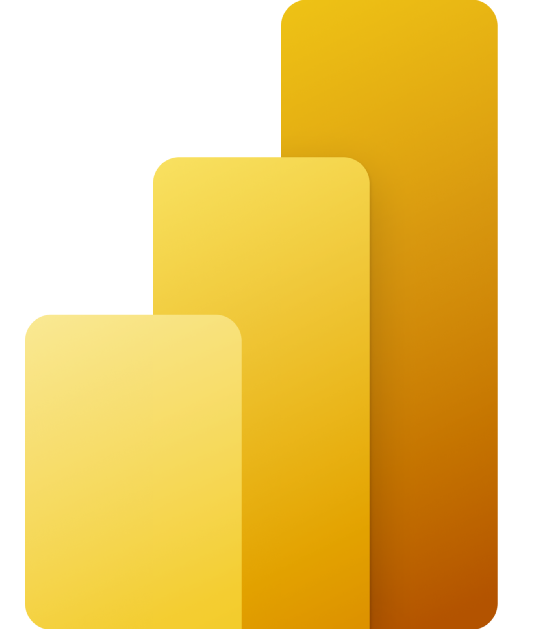

<h1 align="center">Hi, I'm Mina Adel Markos 👋</h1>

<h3 align="center">I am a junior data scientist and data
analyst who is passionate about data
science and machine learning. i can
extract meaningful insights by use the
existing information to improve
bessuiness and uncover the actionble
data as well as can make predicting with
machine learning alogorithms ways to
make actionable improvrments and solve
problems</h3>

 

 

## EDUCATION 

-  Bachelor's Degree of Engineering (2021) -- Alexandria University, Egypt
-  Certified Data Scientist Professional Training Progra 9 Months Programg -- EPSILON AI Institute
-  IBM Data Science Professional Certificate 2022 -- Coursera 

## EXPERIENCE 

<h3>Data Analyst at Epsilon Ai -- Internship </h3>

-  Clean, prepare, organize and facilitate access to different types of datasets.
-  Extract data from multiple sources.
-  Use of Machine Learning techniques: Regression, Classificationand Clustering, with ability to build Machine Learning Pipelines

<h3>Data Scientist at Sparks -- Internship</h3>

-  Write codes to collect, crunch and analyze data from internal and external sources
-  Build machine and tune learning models using Python
-  Learn how can extract useful insights to improve the productivity

## 📩 Connect with me

 

 

<!-- 
 
		   
  -->
 

## skills 👀

